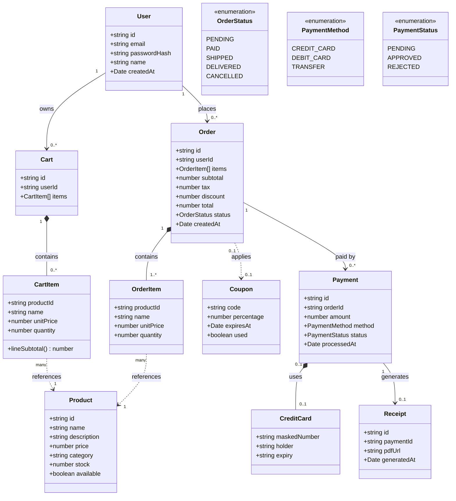
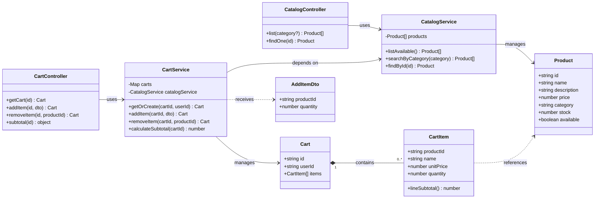
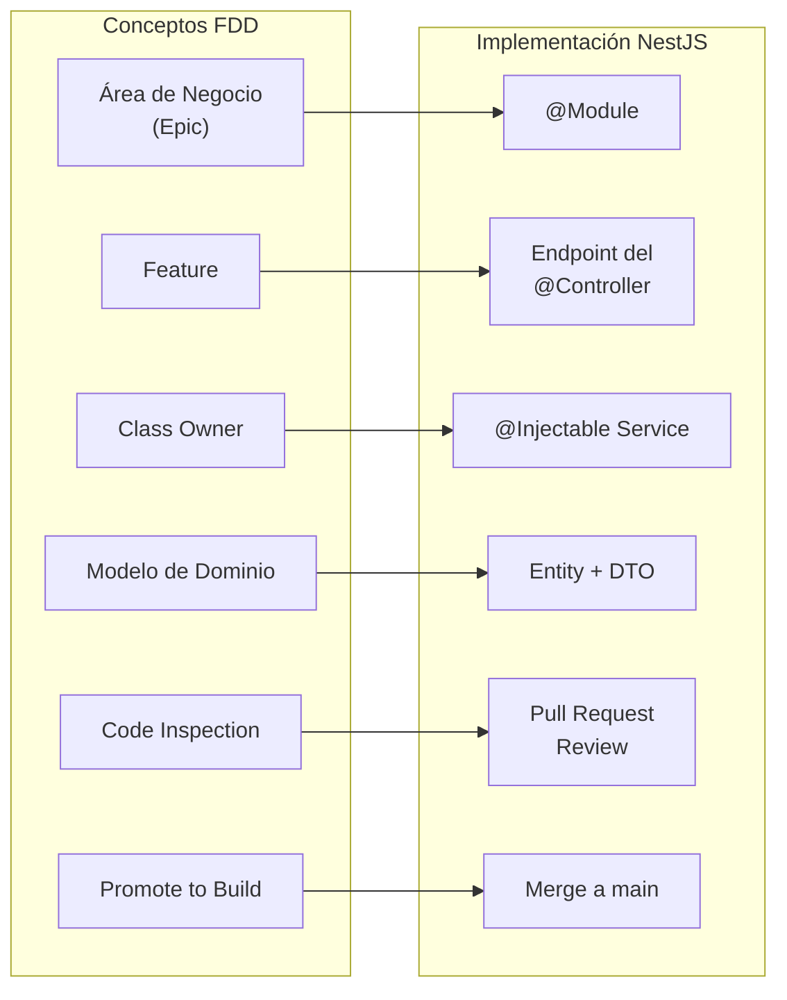
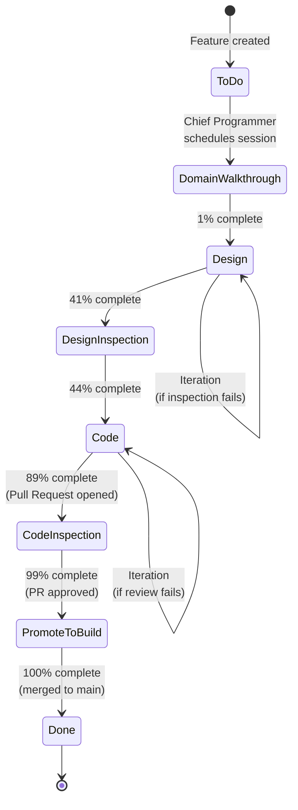
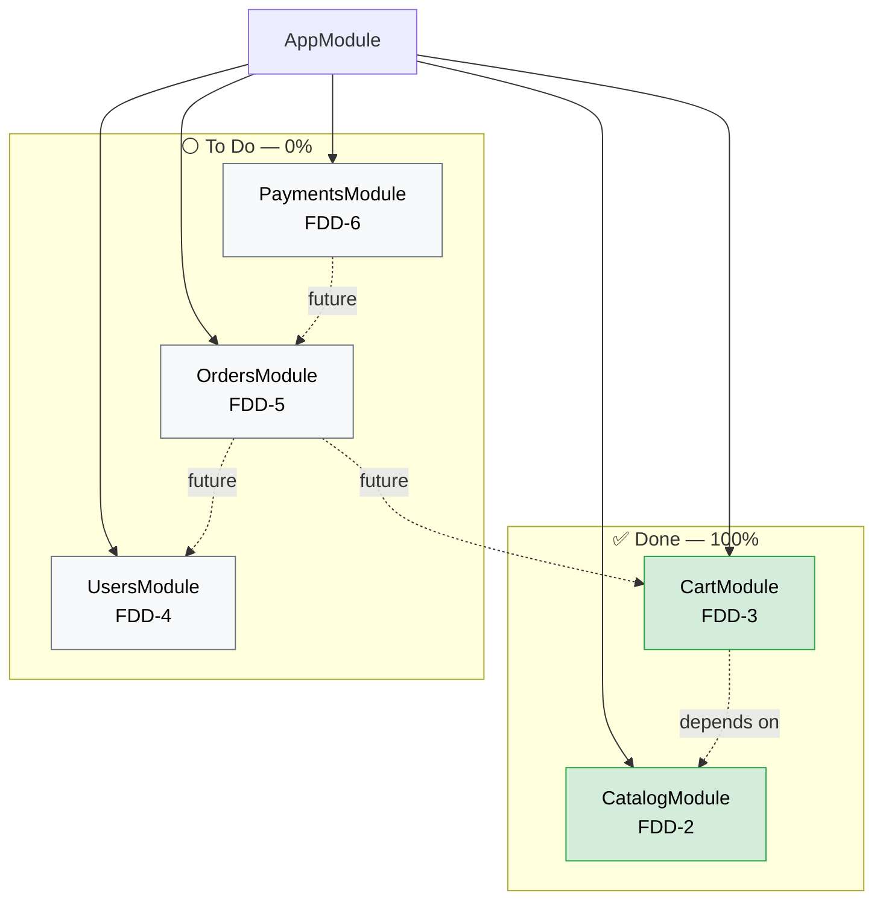

# Modelo de Dominio — Demo FDD E-commerce

Diagramas UML del sistema en Mermaid. Generados como parte de la **Etapa 1 de FDD: Develop Overall Model**.

## 1. Modelo global completo (5 áreas de negocio)

Este es el modelo que se construiría en la Etapa 1 de FDD con los expertos del dominio, antes de empezar a codificar. Incluye las 5 áreas: Catálogo, Carrito, Usuarios, Pedidos y Pagos.

## 2. Modelo actual implementado (Catalog + Cart)

Esto es lo que está actualmente en el código (PRs #1-#7 mergeados).

## 3. Mapeo FDD ↔ NestJS

Diagrama conceptual que muestra cómo los conceptos de FDD se mapean a la arquitectura de NestJS.

## 4. Flujo de una Feature por los 6 hitos FDD

Diagrama de estados que muestra el ciclo de vida de una feature en FDD.

## 5. Arquitectura de módulos NestJS (actual)

